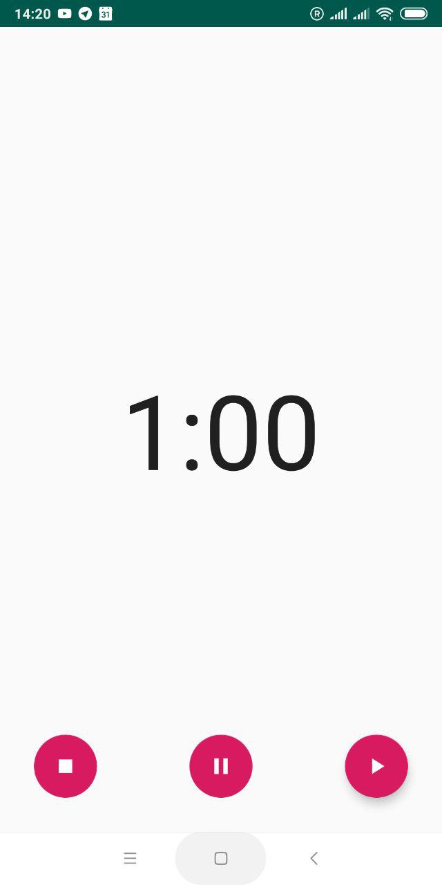
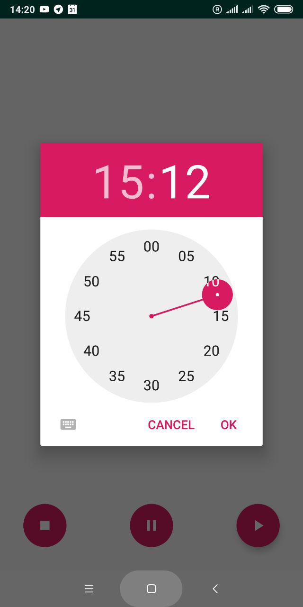
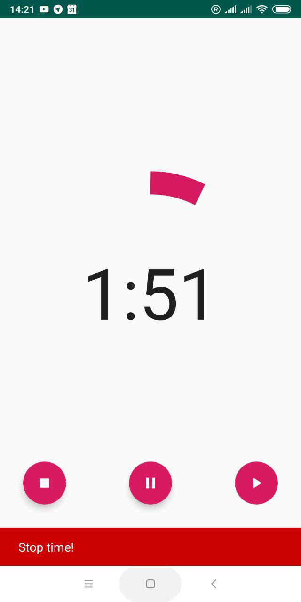

# TimerKotlin
Simple app writed by language Kotlin
## Simple timer which works on background when app is closed.

&nbsp;

<a href="https://github.com/AlieksieievYurii/TimerKotlin/tree/master/apk">APK file</a>
